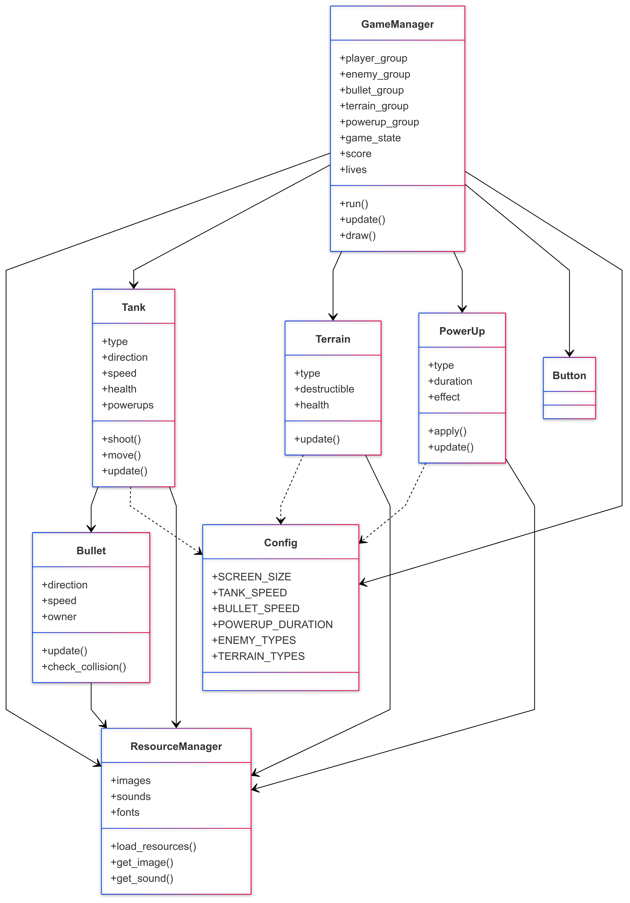
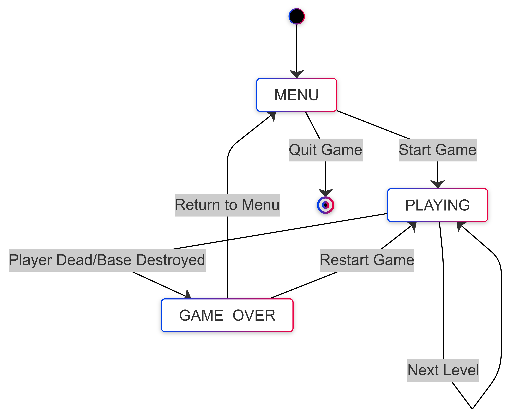
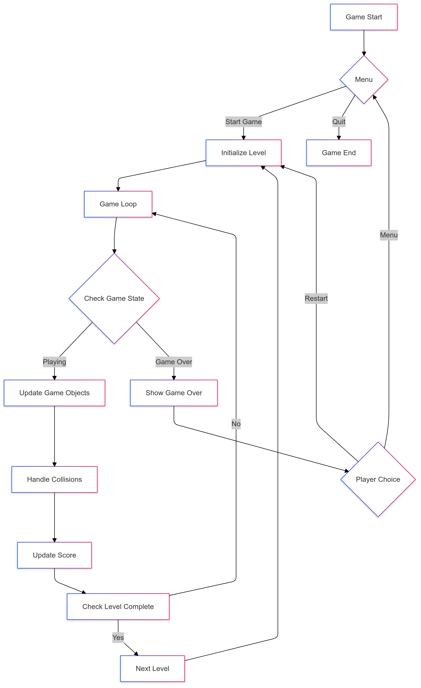
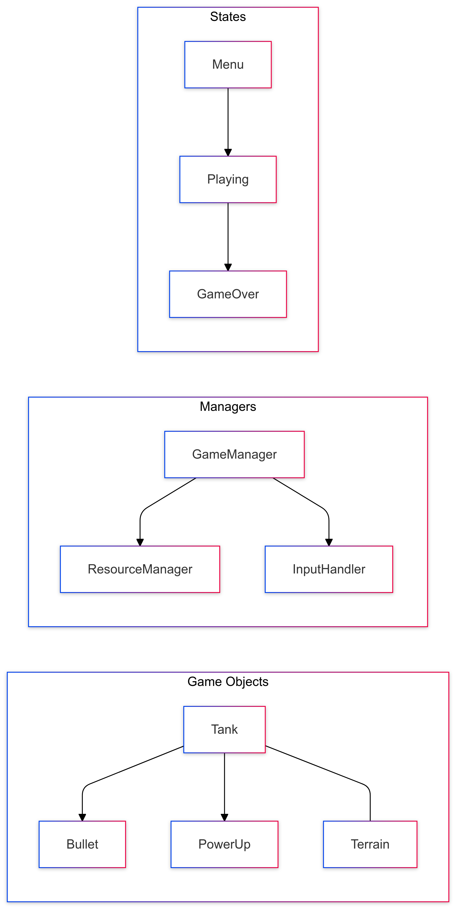

# 坦克大战游戏说明文档

## 0. 项目架构

### 0.1 项目核心架构

### 0.2 游戏状态流转

### 0.3 游戏主流程

### 0.4 游戏对象关系

## 1.项目背景
这是一款单纯使用AI编程工具-Cursor编写的游戏，没有人工编写代码，人工唯一做的就是跟Cursor沟通，告诉它游戏规则，然后它就自动生成代码，并自动运行。

## 2. 游戏简介
这是一款经典的坦克大战游戏，玩家需要操控坦克在战场上与敌方坦克作战，保护基地不被摧毁。游戏融合了经典玩法和现代特色，包含多种道具系统和关卡设计。

## 3. 基本操作
- 方向键：控制坦克移动（上下左右）
- 空格键：发射子弹
- ESC键：暂停游戏/返回主菜单

## 4. 游戏规则

### 4.1 基本目标
- 保护基地不被摧毁
- 消灭所有敌方坦克
- 通过所有关卡（共5关）

### 4.2 得分系统
- 击毁敌方坦克：100分
- 收集道具：50分
- 通过关卡：500分

### 4.3 生命系统
- 初始生命值：3条
- 被敌方子弹击中损失1条生命
- 生命值耗尽游戏结束

## 5. 游戏特色

### 5.1 多样化地形
- 砖墙：可被摧毁的普通墙体
- 钢铁：无法被摧毁的坚固墙体
- 水域：无法通过的地形
- 草地：可以穿过，提供隐蔽

### 5.2 道具系统
1. 护盾道具
   - 效果：临时无敌
   - 持续时间：5秒
   - 特征：闪烁效果

2. 速度提升
   - 效果：移动速度提升50%
   - 持续时间：10秒
   - 特征：黄色标识

3. 快速射击
   - 效果：射击间隔减少50%
   - 持续时间：10秒
   - 特征：红色标识

4. 基地加固
   - 效果：基地周围的砖墙变为钢铁墙
   - 持续时间：15秒
   - 特征：银色标识

### 5.3 敌人类型
1. 普通坦克
   - 特点：基础属性平衡
   - 击毁得分：100分

2. 快速坦克
   - 特点：移动速度快，但防御力低
   - 击毁得分：200分

3. 重型坦克
   - 特点：移动慢，但生命值高
   - 击毁得分：300分

4. 精英坦克
   - 特点：全面强化的属性
   - 击毁得分：500分

## 6. 关卡系统

### 6.1 关卡特点
- 第1关：简单难度，主要是普通和快速坦克
- 第2关：引入重型坦克，地形更复杂
- 第3关：出现精英坦克，敌人数量增加
- 第4关：敌人类型更加多样化
- 第5关：最终关卡，最具挑战性

### 6.2 关卡进阶
- 每关敌人数量递增
- 地形密度逐渐增加
- 敌人类型逐渐丰富
- 道具掉落概率保持稳定（30%）

## 7. 界面说明

### 7.1 HUD显示
- 左侧：游戏主画面
- 右侧信息栏：
  - 当前生命值
  - 当前分数
  - 当前关卡
  - 剩余敌人数量
  - 道具状态显示

### 7.2 道具状态显示
- 显示所有当前激活的道具
- 显示每个道具的剩余时间
- 未激活的道具显示为灰色
- 激活的道具显示为绿色

## 8. 游戏技巧
1. 合理利用地形：
   - 使用砖墙作为掩护
   - 在草地中埋伏敌人
   - 利用水域阻挡敌人路线

2. 道具使用策略：
   - 在危险时刻使用护盾
   - 速度提升适合快速转移
   - 快速射击适合清理多个敌人
   - 基地受到威胁时使用基地加固

3. 战术建议：
   - 优先保护基地
   - 注意收集道具
   - 避免与多个敌人同时交战
   - 记住敌人的生成点位置

## 9. 注意事项
1. 游戏存档：游戏不支持中途存档
2. 游戏暂停：按ESC键可暂停游戏
3. 重新开始：游戏结束后可选择重新开始或返回主菜单
4. 窗口大小：固定为950x600像素（800x600游戏区域 + 150像素信息栏）
